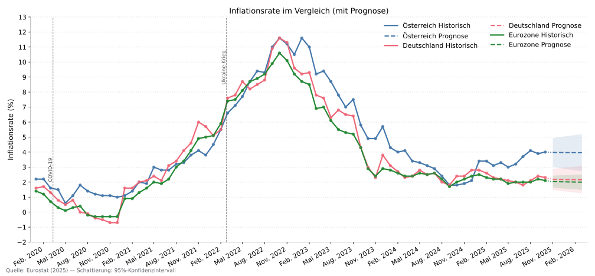
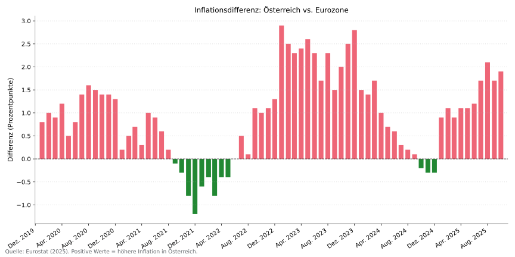
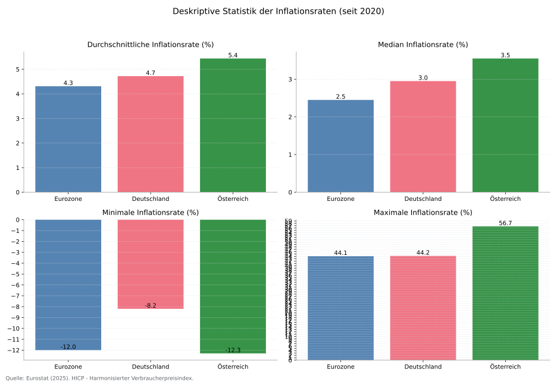
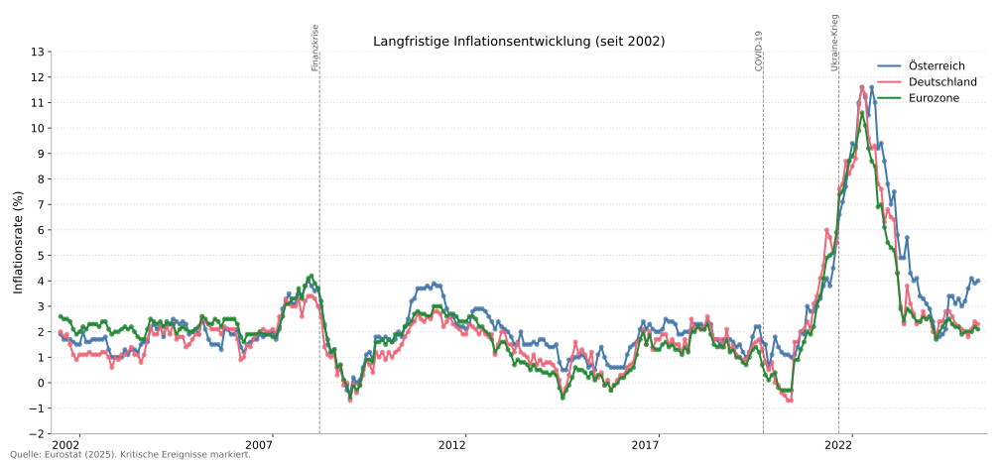
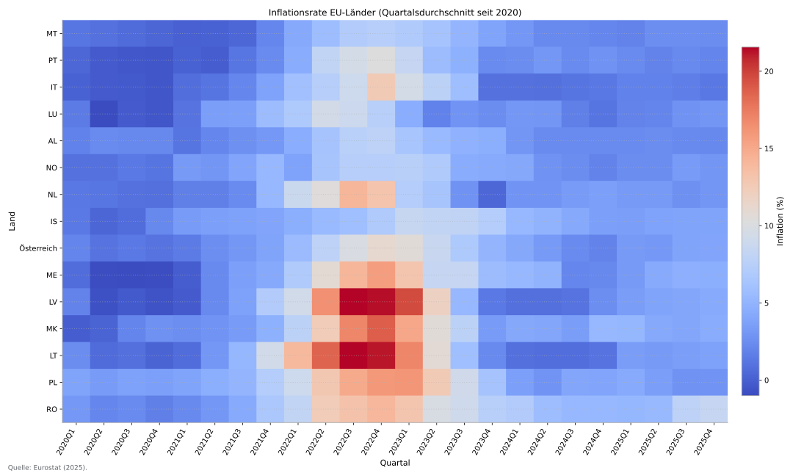

# Inflationsbericht Österreich


Ein Werkzeug zur Analyse und Visualisierung von Inflationsdaten für Österreich im Vergleich zu Deutschland und dem Euroraum.

## Übersicht

Dieses Projekt bietet einen automatisierten Arbeitsablauf zum Abrufen, Analysieren und Visualisieren von Inflationsdaten von Eurostat. Der Fokus liegt auf der reproduzierbaren Erstellung hochwertiger SVG-Grafiken, die direkt in Präsentationen oder Berichten genutzt werden können.

## Funktionen

### Datenanalyse
- **Datenquelle**: Eurostat HICP (Harmonisierter Verbraucherpreisindex, `prc_hicp_manr`).
- **Geografischer Geltungsbereich**: Österreich, Deutschland und der Euroraum (EA20).
- **Frequenz**: Monatliche Jahresveränderungsraten der Inflation.
- **Zeitraum**: Von 2002 bis zu den aktuellsten verfügbaren Daten.
- **Datenaktualisierung**: Ruft bei jeder Ausführung die neuesten Daten direkt von der Eurostat-API ab.

### Prognose
- **Primärmodell**: Holt-Winters Exponentielle Glättung mit gedämpftem Trend für Zeitreihenprognosen.
- **Fallback-Modell**: Lineare Regression wird verwendet, wenn der Datensatz für das Holt-Winters-Modell nicht ausreicht.
- **Trainingszeitraum**: Die letzten 24 Monate der Daten werden für das Modelltraining verwendet.
- **Konfidenzintervalle**: 95%-Prädiktionsintervalle werden berechnet und an den Prognosehorizont angepasst.

### Statistische Analyse
- Deskriptive Statistiken (Mittelwert, Median, Standardabweichung).
- Identifizierung von Trends und Extremwerten.
- Vergleichende Analyse zwischen den ausgewählten Regionen.
- Berechnung von Inflationsdifferenzen.

### Visualisierungen
Das Tool generiert die folgenden SVG-Diagramme:
1.  `inflation_comparison.svg`: Vergleichende Darstellung der Inflationsraten mit Prognosen.
2.  `ecb_interest_rates.svg`: EZB-Leitzinsen seit 2000.
3.  `inflation_difference.svg`: Inflationsdifferenz zwischen Österreich und dem Euroraum.
4.  `statistics_comparison.svg`: Vergleichende Visualisierung der wichtigsten statistischen Kennzahlen.
5.  `historical_comparison.svg`: Langfristige Inflationsentwicklung seit 2002 mit Markierungen für wichtige wirtschaftliche Ereignisse.
6.  `eu_inflation_heatmap.svg`: Eine Heatmap der Inflationsraten in der Europäischen Union.

### Output
- Schlanke SVG-Grafiken ohne HTML/Text-Berichte
- Separate Makefile-Targets zum Erzeugen (`make figures`) und Aufräumen (`make clean`) der Ausgaben

### Vorschau (Beispiele)
> Hinweis: Aktualisiere die Vorschaubilder mit `make previews` (ruft `make figures` auf und kopiert die SVGs nach `docs/previews/`).

| Plot | Vorschau |
| --- | --- |
| Inflation Comparison |  |
| ECB Interest Rates |  |
| Inflation Difference |  |
| Statistics Comparison |  |
| Historical Comparison |  |
| EU Inflation Heatmap |  |

## Erste Schritte

### Voraussetzungen
- Python 3.8 oder höher.

### Installation

1.  **Repository klonen**:
    ```bash
    git clone https://github.com/jstreitberger03/inflation-report-austria.git
    cd inflation-report-austria
    ```

2.  **Virtuelle Umgebung erstellen und aktivieren** (empfohlen):
    - Windows:
      ```bash
      python -m venv .venv
      .venv\Scripts\activate
      ```
    - macOS/Linux:
      ```bash
      python -m venv .venv
      source .venv/bin/activate
      ```

3.  **Abhängigkeiten installieren** (benötigt das Nachbar-Repository `python-plot-template`):
    ```bash
    pip install .
    ```
    Falls das Template-Repo nicht neben diesem Projekt liegt, passen Sie den Pfad in `pyproject.toml` an oder installieren Sie es direkt:
    ```bash
    pip install -e ../python-plot-template
    ```

### Verwendung

Erzeugen Sie die Grafiken mit dem Makefile:
```bash
make figures
```

Die SVG-Dateien werden im Verzeichnis `output/` gespeichert. Zum Aufräumen:
```bash
make clean
```

## Projektstruktur

```
inflation-report-austria/
│
├── Makefile              # Targets für figures/clean
├── main.py               # Hauptskript zur Orchestrierung des Arbeitsablaufs
├── config.yaml           # Konfigurationsdatei für Parameter
├── inflation_report/     # Paket mit Datenabruf, Analyse und Visualisierung
├── README.md             # Projektdokumentation
│
└── output/               # Generierte SVG-Grafiken (im Git ignoriert)
    └── *.svg
```

## Methodik

### Datenquelle
- **Anbieter**: Eurostat
- **Datensatz**: `prc_hicp_manr` (HVPI - monatliche Daten, jährliche Veränderungsrate)
- **Regionen**: Österreich (AT), Deutschland (DE), Euroraum (EA20)

### Prognosemodell
Das primäre Prognosemodell ist die **Holt-Winters Exponentielle Glättung** mit einem additiven, gedämpften Trend. Diese Methode eignet sich gut für nicht-saisonale Zeitreihen mit einem Trend. Wenn die Zeitreihe für dieses Modell zu kurz ist, wird als Fallback eine einfache **lineare Regression** über die letzten 12 Monate verwendet.

- **Trainingsdaten**: Das Modell wird auf den Daten der letzten 24 Monate trainiert, um sich an aktuelle Trends anzupassen.
- **Konfidenzintervalle**: 95%-Prädiktionsintervalle werden auf Basis der Standardabweichung der Modellresiduen berechnet, mit einer Anpassung für den Prognosehorizont.

## Technologie-Stack

| Komponente         | Technologie   |
|--------------------|---------------|
| **Kern**           | Python 3.8+   |
| **Datenverarbeitung**| pandas        |
| **Statistik**      | statsmodels   |
| **ML-Fallback**    | scikit-learn  |
| **Visualisierung** | Matplotlib + python-plot-template |
| **API-Client**     | eurostat      |
| **Numerik**        | numpy         |

## Lizenz

Dieses Projekt ist unter der MIT-Lizenz lizenziert. Weitere Informationen finden Sie in der `LICENSE`-Datei.
